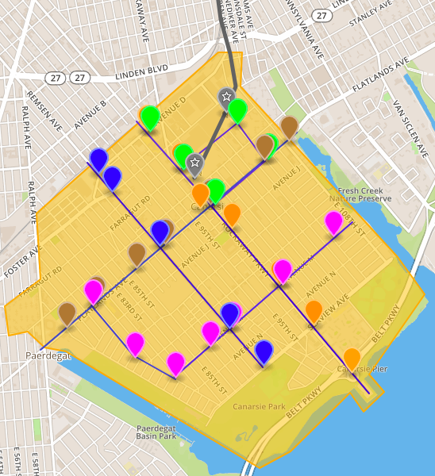
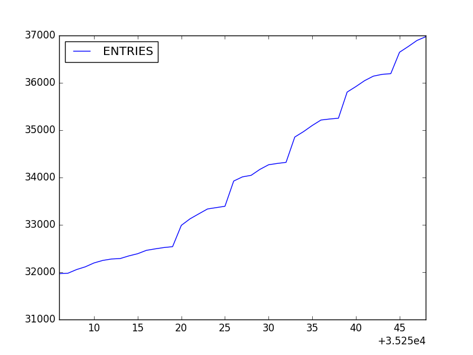
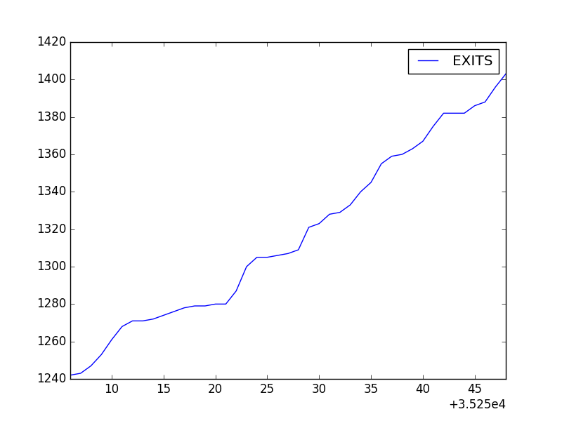
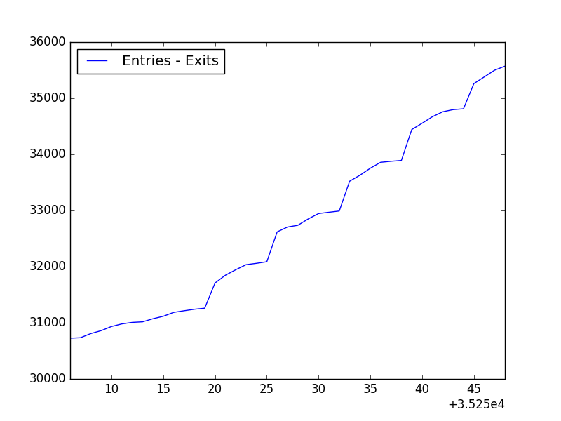

# Canarsie, NY

This map is centered around Canarsie, New York with the L-line shown in Gray, and popular bus lines and their routes show in various colors.
___

## Demographics of Neighborhood
#### Total Population in Canarsie: 92,399

|Race     |Percentage|
|---------|---------:|
|White    |22%       |
|Black    |64%       |
|Hispanic |4%        |
|Asian    |9%        |
|Other    |1%        |

#### Average Per Capita Income: $28,580
#### Median Household Income: $75,391
#### Percentage of People Below the Poverty Line: ~9%
|Income        |Percentage|
|--------------|---------:|
|Under $50K    |34%       |
|$50K - $100K  |32%       |
|$100K - $200K |28%       |
|Over $200K    |6%        |

#### Average Commute to Work: 48 Minutes
|Commute to Work |Percentage|
|----------------|---------:|
|Drove Alone     |39%       |
|Carpooled       |6%        |
|Public Transit  |48%       |
|Bicycle         |1%        |
|Walked          |3%        |
|Other           |1%        |
|Worked At Home  |3%        |
___

## Station Usage Statistics
Station Usage Statistics

